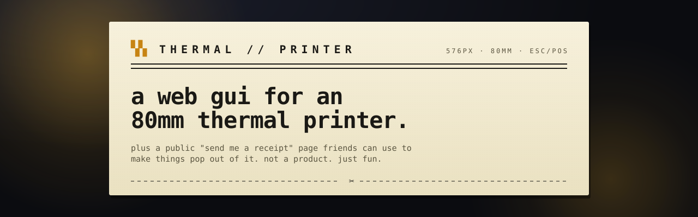

<p align="center">
  
</p>

<p align="center">
  <em>A web GUI for my 80mm USB thermal receipt printer,<br/>
  plus a tiny public "send me a receipt" page friends can use to make things pop out of it.</em>
</p>

<p align="center">
  <a href="#quick-start">Quick start</a> ·
  <a href="#deploy-to-a-raspberry-pi">Deploy</a> ·
  <a href="#configuration">Config</a> ·
  <a href="#tests">Tests</a> ·
  <a href="DEPLOY.md">Runbook</a>
</p>

---

## What's inside

**Main console** — `/admin` · at <https://print.cuzeth.com/admin>, unlocked with a 6-digit TOTP code from your authenticator app.

| Tab | What it does |
|---|---|
| **Compose** | Rich-text editor with live preview. Markup: `**bold**`, `__underline__`, `~big~`, `#`/`##` headings, `>` centered, `-` bullets, `[ ]`/`[x]` todos, `---`/`===` rules, `!!!` cut markers. |
| **Image** | Drop an image, tune contrast/brightness/threshold, Floyd–Steinberg dither, print. |
| **Codes** | QR + 1D barcodes (CODE128, CODE39, EAN-13, EAN-8, UPC-A, ITF, CODABAR). Preview in the browser, print natively via ESC/POS. |
| **Widgets** | Morning briefing combo, weather (wttr.in), Hacker News, on-this-day (Wikipedia), advice, calendar, countdown, habit tracker, dice, ASCII art, "now" card. |
| **Labs** | Todo list, label maker, fake receipt. |
| **Hardware** | Cash drawer, beep, feed, cut, density, code page, LED (best-effort), status query. |
| **Console** | Raw ESC/POS byte sender with a built-in cheat sheet. Accepts hex (`1b 40 48 69`) or Python escapes (`\x1b@Hi\n`). |
| **Admin** | Approve / block / delete friends, review recent prints. |

**Friends page** — `/` · public at <https://print.cuzeth.com>, via Cloudflare Tunnel.

Friends register with a username + password, sit pending until you approve them from the Admin tab, then send you messages that print immediately with their name attached. Supports the same markup vocabulary as the composer.

**Security model:** one Cloudflare Tunnel, one hostname, and the app defends itself. `print.cuzeth.com` fronts `127.0.0.1:5005` with no edge auth ([deploy/cloudflared-config.yml](deploy/cloudflared-config.yml)); friends get signed-cookie sessions, and the owner unlocks `/admin` with an RFC 6238 TOTP code (`auth/totp.py`, secret in `.env`, enrolled in any authenticator app). Admin sessions expire after 12 hours; each code is single-use (replay guard), and the login carries per-IP *and* global failure lockouts because 6-digit codes are a small space (`auth/admin.py`). `/api/admin/*` also accepts `Bearer ADMIN_TOKEN` for curl and the smoke tests. Flask must bind to `127.0.0.1` so the tunnel is the only way in — the rate limiters trust the last `X-Forwarded-For` hop, which only Cloudflare should be appending.

Abuse limits (all in-memory, reset on restart):
- friend prints go through a FIFO queue (50 jobs max, 3 in-flight per user)
- 10 failed logins / 15 min per username
- 30 failed logins / 15 min per IP
- 5 signups / hour per IP
- TOTP login: 10 failures / 15 min per IP, 30 globally

---

## Quick start

```sh
python3 -m venv .venv && source .venv/bin/activate
pip install -r requirements.txt
DEV_BYPASS_ADMIN=true COOKIE_SECURE=false python3 app.py
```

Open <http://localhost:5005/admin> for the console, <http://localhost:5005> for the friends page.

Both env vars are load-bearing in local dev:
- `DEV_BYPASS_ADMIN=true` — skips the TOTP login so `/admin` and `/api/admin/*` open without a code.
- `COOKIE_SECURE=false` — the default is `true` (prod is HTTPS), and without it over plain HTTP the browser silently drops the session cookie and every friend request fails as "not signed in."

For a local friends demo, open <http://localhost:5005>, click **Create an account**, pick any username + password (8+ chars), then approve yourself from the Admin tab in the console.

Set `DRY_RUN=true` to skip USB and dump ESC/POS bytes to `./data/last_print.bin` instead. Useful for iterating on layouts without burning paper.

Set `FLASK_DEBUG=1` **locally only** if you want the Werkzeug reloader. Never on the Pi — the app is public at print.cuzeth.com and the debugger page is RCE.

---

## Deploy to a Raspberry Pi

Short version:

1. Flash Raspberry Pi OS Lite (64-bit), set hostname `thermal-printer`, enable SSH.
2. `bash deploy/setup.sh` — installs system deps, creates a venv, pip-installs, drops the udev rule and systemd unit.
3. `cp .env.example .env` and fill in `SECRET_KEY`, `ADMIN_TOKEN`, and `TOTP_SECRET`. Commands to generate them:
   ```sh
   python3 -c "import secrets; print('SECRET_KEY=' + secrets.token_hex(32))"
   python3 -c "import secrets; print('ADMIN_TOKEN=' + secrets.token_urlsafe(32))"
   python3 scripts/gen_totp.py    # prints a QR to scan + the TOTP_SECRET line
   ```
4. Set up the Cloudflare Tunnel — `cloudflared` install, tunnel creation, and the DNS route for print.cuzeth.com are step-by-step in [DEPLOY.md](DEPLOY.md). No Access application, no Transform Rules — auth lives in the app.
5. `sudo systemctl start thermal-printer && journalctl -u thermal-printer -f`.

The systemd unit runs gunicorn with `--workers 1 --threads 4` — single-worker is load-bearing because the USB lock and the friend print queue both live in process-local memory.

Full step-by-step (udev, tunnel wiring, troubleshooting) lives in [DEPLOY.md](DEPLOY.md).

---

## Configuration

Everything is env-driven with sensible defaults. Copy [`.env.example`](.env.example) to `.env` on the Pi and fill in what you need.

| Variable | Required? | Default | Notes |
|---|---|---|---|
| `SECRET_KEY` | yes (prod) | random per boot | Flask session signing. Persist to keep sessions across restarts. |
| `ADMIN_TOKEN` | yes (prod) | random per boot | Bearer alternative to the TOTP session for `/api/admin/*` — used by curl and the smoke tests. |
| `TOTP_SECRET` | yes (prod) | (empty) | Base32 secret behind the `/admin` login. Generate + enroll with `python3 scripts/gen_totp.py`. Empty = TOTP login fails closed (Bearer still works). |
| `HOST` / `PORT` | no | `127.0.0.1` / `5005` | Must be `127.0.0.1` in prod — only cloudflared may reach the app, because the rate limiters trust the last `X-Forwarded-For` hop. |
| `DEV_BYPASS_ADMIN` | no | `false` | Skips the TOTP login entirely. Set `true` for local dev; **never** on the Pi. |
| `COOKIE_SECURE` | no | `true` | Secure-flag session cookies. Default fits prod (both hostnames are HTTPS). For local HTTP dev, set `COOKIE_SECURE=false` — otherwise the browser drops the session cookie and friends can't stay signed in. |
| `DRY_RUN` | no | `false` | Write ESC/POS bytes to `data/last_print.bin` instead of USB. |
| `DEFAULT_LOCATION` | no | `Phoenix` | Fallback city for the weather widget and morning briefing; also prefills the GUI inputs. |
| `BRIEFING_SCHEDULE` | no | (off) | Set `HH:MM` (24h) to auto-print the morning briefing daily. Empty = off. |
| `USB_VENDOR_ID` / `USB_PRODUCT_ID` | no | `0x0483` / `0x5720` | Match your printer. |
| `RECEIPT_WIDTH` / `PRINTER_PIXEL_WIDTH` | no | `42` / `576` | 42 cols / 576 px = 80mm. For 58mm use `32` / `384`. |
| `DATA_DIR` | no | `./data` | SQLite + `last_print.bin` live here. |
| `FLASK_DEBUG` | — | unset | **Never** set on the Pi. |

---

## Tests

```sh
pip install pytest
pytest                              # render / widgets / image / routes
python scripts/test_auth_flow.py    # end-to-end auth against the Flask test client
```

CI runs both on push + PR (see [.github/workflows/ci.yml](.github/workflows/ci.yml)). No USB is touched — everything exercises DRY_RUN.

---

## Stack

- **Backend** · Python 3.12 · Flask · gunicorn · python-escpos · Pillow · SQLite (WAL)
- **Frontend** · vanilla JS, no build step
- **Auth** · werkzeug scrypt for passwords, signed-cookie sessions for friends, stdlib RFC 6238 TOTP for the owner (bearer token for scripts)
- **Hosting** · Raspberry Pi · one Cloudflare Tunnel, one hostname: print.cuzeth.com (friends at `/`, console at `/admin`)

---

## Project layout

<details>
<summary>click to expand</summary>

```
app.py                  Flask entrypoint + route definitions
config.py               env-driven config
printer.py              python-escpos context manager + USB lock
smoke.py                quick DRY_RUN sanity exerciser
features/
  codes.py              QR + barcode (preview in PIL, print via ESC/POS native)
  hardware.py           cash drawer, cut, feed, density, status, raw bytes
  image.py              upload → grayscale → dither/threshold → 1-bit
  led.py                LED protocol candidates for vendor-specific units
  markup.py             shared inline-markup grammar (spans: bold/underline/big)
  render.py             PIL-based rich-text rasterizer (growable canvas)
  text.py               plain-text composer (ROM-font path)
  widgets.py            weather / HN / on-this-day / dice / todo / …
auth/
  totp.py               stdlib RFC 6238 TOTP (the /admin login)
  admin.py              /api/admin/auth/{login,logout} + lockouts + replay guard
  ratelimit.py          shared in-memory sliding-window buckets
  db.py                 SQLite schema + CRUD (users, messages)
  session.py            require_allowed / require_admin + session helpers
  blueprint.py          /api/auth/{register,login,logout} + /me
templates/
  index.html            main GUI (tabs), served at /admin
  admin_login.html      the TOTP code prompt
  friends.html          public friends page, served at /
static/
  app.js / style.css    main GUI
  friends.js / .css     friends page
tests/                  pytest: render / widgets / image / routes / security / totp / queue
scripts/
  test_auth_flow.py     Flask-test-client auth smoke
  gen_totp.py           mint TOTP_SECRET + QR for authenticator enrollment
deploy/
  thermal-printer.service   systemd unit (gunicorn, workers=1)
  99-thermal-printer.rules  udev rule (USB access for non-root)
  cloudflared-config.yml    Cloudflare Tunnel ingress (one hostname)
  setup.sh                  idempotent Pi bootstrapper
docs/banner.svg         the receipt up top
.github/workflows/ci.yml    pytest + auth smoke on push/PR
DEPLOY.md               Raspberry Pi run-book
MIGRATION.md            one-time cutover: Tailscale Funnel -> Cloudflare + TOTP
.env.example            what to fill into .env on the Pi
```

</details>
